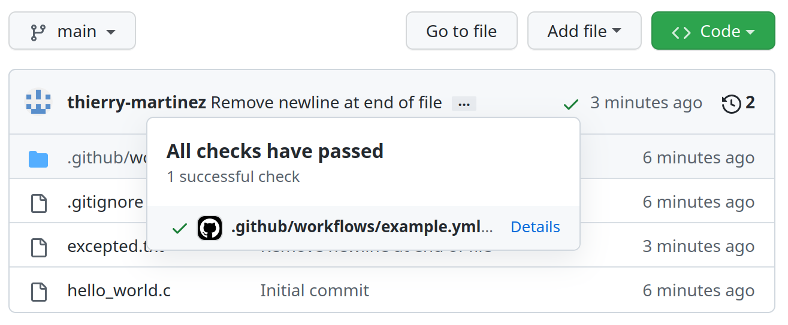
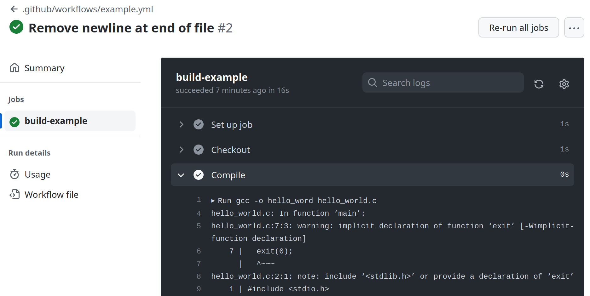

<style>
{
  font-size: 16pt;
}
</style>

# [GitHub Actions]

[GitHub Actions]: https://docs.github.com/en/actions

Thierry Martinez (SED)
Developer meetup, 13 december 2022

--- 

## [GitHub Actions]

- A [continuous integration] (CI) platform for GitHub-hosted
projects, [launched on 16 October 2018].

[continuous integration]: https://en.wikipedia.org/wiki/Continuous_integration
[launched on 16 October 2018]: https://github.blog/2018-10-16-future-of-software/

- Providing [GitHub-hosted runners] for Linux, MacOS and Windows.

  [GitHub-hosted runners]: https://docs.github.com/en/actions/using-github-hosted-runners/about-github-hosted-runners#supported-runners-and-hardware-resources

- File-based workflow specification: `.github/workflows/*.yml`.
  A command-line tool, `act` is available for running workflows
  locally (or from other continuous integration platforms):
  https://github.com/nektos/act

- Very easy to extend (new [reusable actions] can be defined in git
  repositories), Linux runners can run docker containers,
  user-provided runners can be used.

[reusable actions]: https://docs.github.com/en/actions/creating-actions/creating-a-composite-action

---

## [Continuous integration]

[Continuous integration] (CI): practice of short-lived
development cycles, automatically tested and shared regularly between
developers involved in a project.

[Continuous integration]: https://en.wikipedia.org/wiki/Continuous_integration

Continuous integration platforms: [Github Actions], [ci.inria.fr], [gitlab.inria.fr].

[ci.inria.fr]: https://ci.inria.fr
[gitlab.inria.fr]: https://gitlab.inria.fr

Automating testing (and CI in general) relies on [version control] and
automated builds. 

- speed up development process,

- ease collaboration 

- allow programmers to be more confident for not introducing regression and bugs.

[version control]: https://en.wikipedia.org/wiki/Version_control

This is a step towards broader goals such as [reproducible
builds] and [reproducible research].

[reproducible builds]: https://en.wikipedia.org/wiki/Reproducible_builds
[reproducible research]: https://en.wikipedia.org/wiki/Reproducibility

---

## [GitHub-hosted runners]

- Hardware specification for Windows and Linux virtual machines:

    - 2-core CPU (x86_64)
    - 7 GB of RAM
    - 14 GB of SSD space

- Hardware specification for macOS virtual machines:

    - 3-core CPU (x86_64)
    - 14 GB of RAM
    - 14 GB of SSD space

[Usage limits, billing](https://docs.github.com/en/actions/learn-github-actions/usage-limits-billing-and-administration): available for free for public repositories,
- up to 20 concurrent jobs (Linux/Windows),
- 5 concurrent jobs for macOS.

---

## [Self-hosted runners]

[Self-hosted runners]: https://docs.github.com/en/actions/hosting-your-own-runners/adding-self-hosted-runners


---

## Example of workflow

In `.github/workflows/example.yml`:

```yaml
on: [push]
jobs:
  build-example:
    runs-on: ubuntu-latest
    steps:
      - name: Checkout
        uses: actions/checkout@v3
      - name: Compile
        run: |
          gcc -o hello_word hello_world.c
      - name: Test
        run: |
          ./hello_word > output.txt
          diff output.txt excepted.txt
```

---

## Action status visible on repository index



---

## Access to logs in action details



---

## Automatic actions in repositories

- Test pull-requests automatically

- Check code formatting, linting

- Publish releases and documentation (Continuous Delivery/Continuous Deployment)

- Generate automatic posts in pull-requests for coverage analysis, performance reports

- Automatic triage of pull-requests, use chatGPT for automatically answering pull requests, etc, etc


--- 

## Training course on Thursday morning, 10am-12pm

Alexandre Abadie (SED) and myself will give a training course about GitHub Actions on

### Thursday morning, 10am-12pm, at Inria Paris, room Gilles Kahn 1&2

---

# Thank you for your attention!

