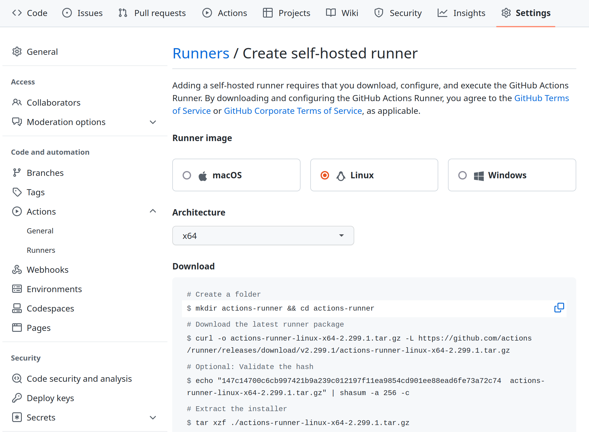
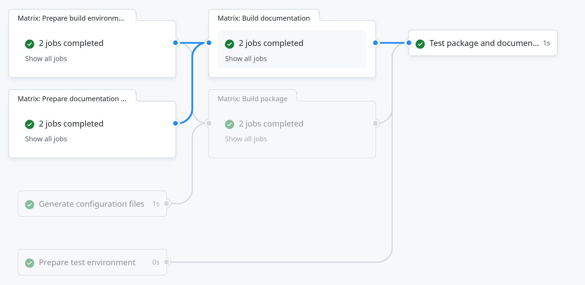
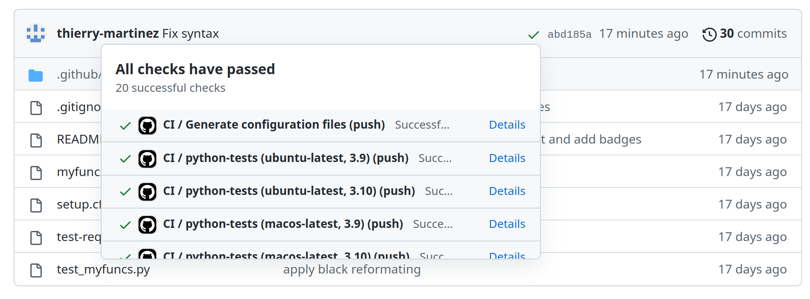
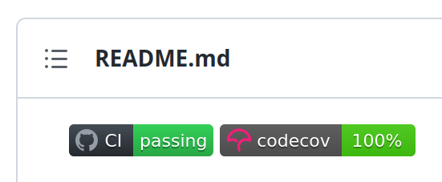
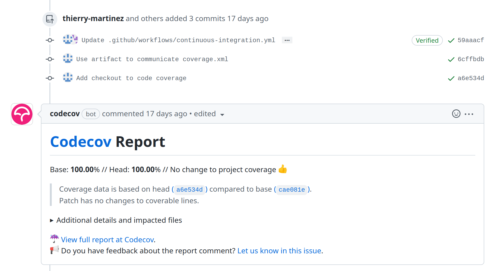

<style>
{
  font-size: 16pt;
}
</style>

# [GitHub Actions]

[GitHub Actions]: https://docs.github.com/en/actions

Alexandre Abadie, Thierry Martinez (SED)
Two-hours training, 15 december 2022

---

## GitHub Actions

- A [continuous integration] (CI) platform for GitHub-hosted
projects, [launched on 16 October 2018].

[continuous integration]: https://en.wikipedia.org/wiki/Continuous_integration
[launched on 16 October 2018]: https://github.blog/2018-10-16-future-of-software/

- Providing [GitHub-hosted runners] for Linux, MacOS and Windows.

  [GitHub-hosted runners]: https://docs.github.com/en/actions/using-github-hosted-runners/about-github-hosted-runners#supported-runners-and-hardware-resources

- File-based workflow specification: `.github/workflows/*.yml`.
  A command-line tool, `act` is available for running workflows
  locally (or from other continuous integration platforms):
  https://github.com/nektos/act

- Very easy to extend (new [reusable actions] can be defined in git
  repositories), Linux runners can run docker containers,
  user-provided runners can be used.

[reusable actions]: https://docs.github.com/en/actions/creating-actions/creating-a-composite-action

---

## [Continuous integration]

[Continuous integration] (CI): practice of short-lived
development cycles, automatically tested and shared regularly between
developers involved in a project.

[Continuous integration]: https://en.wikipedia.org/wiki/Continuous_integration

Continuous integration platforms: [Github Actions], [ci.inria.fr], [gitlab.inria.fr].

[ci.inria.fr]: https://ci.inria.fr
[gitlab.inria.fr]: https://gitlab.inria.fr

Automating testing (and CI in general) relies on [version control] and
automated builds. 

- speed up development process,

- ease collaboration 

- allow programmers to be more confident for not introducing regression and bugs.

[version control]: https://en.wikipedia.org/wiki/Version_control

This is a step towards broader goals such as [reproducible
builds] and [reproducible research].

[reproducible builds]: https://en.wikipedia.org/wiki/Reproducible_builds
[reproducible research]: https://en.wikipedia.org/wiki/Reproducibility

---

## About [version control]

Version control systems are software dedicated for managing
- history and
- collaborative edition
of source code or any other kind of documents.

The prominent software for version control is now [git],
initially developed in 2005 by Linus Torvalds to manage the Linux
source code.

[git]: https://en.wikipedia.org/wiki/Git

[git] is a decentralized tool (where versions are directly exchanged
between peers) but most uses of it now rely on [software forges], like
[GitHub] or gitlab.inria.fr for instance.  Software forges provide
other services related to version control, such as [CI/CD] facilities.

[software forges]: https://en.wikipedia.org/wiki/Forge_(software)

Keeping the history of a code is central
- to make change in the code without losing information and
- to identify where regressions have been introduced ([bisection]).
- to allow code to be modified concurrently by offering merging facilities ([three-way merge]).

[bisection]: https://en.wikipedia.org/wiki/Bisection_(software_engineering)
[three-way merge]: https://en.wikipedia.org/wiki/Merge_(version_control)#Three-way_merge

---

## [GitHub-hosted runners]

- Hardware specification for Windows and Linux virtual machines:

    - 2-core CPU (x86_64)
    - 7 GB of RAM
    - 14 GB of SSD space

- Hardware specification for macOS virtual machines:

    - 3-core CPU (x86_64)
    - 14 GB of RAM
    - 14 GB of SSD space

[Usage limits, billing](https://docs.github.com/en/actions/learn-github-actions/usage-limits-billing-and-administration): available for free for public repositories,
- up to 20 concurrent jobs (Linux/Windows),
- 5 concurrent jobs for macOS.

---

## [Self-hosted runners]

[Self-hosted runners]: https://docs.github.com/en/actions/hosting-your-own-runners/adding-self-hosted-runners



---

## Example of workflow

In `.github/workflows/example.yml`:

```yaml
on: [push]
jobs:
  build-example:
    runs-on: ubuntu-latest
    steps:
      - name: Checkout
        uses: actions/checkout@v3
      - name: Compile
        run: |
          gcc -o hello_word hello_world.c
      - name: Test
        run: |
          ./hello_word > output.txt
          diff output.txt excepted.txt
```
---

### Dependency graph

- Workflow can have arbitrary complex directed acyclic graph as dependency graph.



---

### Status feedback

- On repository index



- In `README.md` badges:
```
[![CI][ci-badge]][ci-link]
```



---

## Status feedback

- In pull requests (in addition, posts can generated by bots invoked from CI)



---

## Repository initialization

- We will use GitHub command line: https://cli.github.com/


- Fork training course repository:

```
gh repo fork --clone aabadie/github-actions-python-example
```

(to create a new repository instead: `gh repo create <repo name> --public --clone`)

- Edit workflow in `github-actions-primer/.github/workflows/continuous-integration.yml`

See [Choosing GitHub hosted runners] for a list of available platforms
for `runs-on` entry. Note that `ubuntu-latest` is currently Ubuntu 20.04.
There is `ubuntu-22.04` available in beta.

[Choosing GitHub hosted runners]: https://docs.github.com/en/actions/using-workflows/workflow-syntax-for-github-actions#choosing-github-hosted-runners

---

## [Running jobs in a container](https://docs.github.com/en/actions/using-jobs/running-jobs-in-a-container)

Build environments can be prepared once for all in a Docker image to
reduce build times:

- `docker build -t ghcr.io/‹user›/‹image name› .`

- [create a personal access token] with scope `write:packages`,
  save it in a file

  [create a personal access token]: https://docs.github.com/en/authentication/keeping-your-account-and-data-secure/creating-a-personal-access-token

- `docker login ghcr.io -u ‹user› --password-stdin < ‹token path›`

- `docker push ghcr.io/‹user›/‹image name›`

- create a personal access token with scope `read:packages`,
  store it in a [secret] (using `gh secret set`)

  [secret]: https://docs.github.com/en/actions/security-guides/encrypted-secrets

- reference the container in the job
```yaml
    container:
      image: ghcr.io/‹user›/‹image name›
      credentials:
        username: ${{ github.actor }}
        password: ${{ secrets.‹secret name› }}
```

- to run the workflow locally, use `act --secret-file ‹file name›`

---

## Matrix job

- Use [`strategy.matrix`] to build the same job with different
  combinations of parameters.
  
  [`strategy.matrix`]: https://docs.github.com/en/actions/using-jobs/using-a-matrix-for-your-jobs

- Set [`strategy.fail-fast: false`] to continue the build of other
  combinations when a combination failed.
  
  [`strategy.fail-fast: false`]: https://docs.github.com/en/actions/using-jobs/using-a-matrix-for-your-jobs#handling-failures

---

## Use a job to build the environment

- Store a personal access token] with scope `write:packages` in a
  secret.
  
- Check out the repository! Add the following action

```
      - name: Checkout
        uses: actions/checkout@v3
```

- Steps for `docker build` and `docker push`.

> :warning: `checkout` action wipes out the current directory!
> Should be run before any actions writing useful things in it (local setup, etc.).

---

## Run a job only if a file has changed

- Checkout with the input `fetch-depth: 2` to get the two last commits (by
  default, only the last commit is checked out, _i.e._ `git fetch --depth=1`)

- Use `git diff --quiet --exit-code HEAD^ HEAD -- ‹path›` to check if
  a file changed.

> :warning: Commands should succeed (with return code 0). Use `if-then-else-fi`
> to control the result of `git diff`.

- Can be done in another job, using [job outputs] and [conditions].

  [job outputs]: https://docs.github.com/en/actions/using-jobs/defining-outputs-for-jobs
  
  [conditions]: https://docs.github.com/en/actions/using-jobs/using-conditions-to-control-job-execution

- We only want to build the image if `Dockerfile` has changed, but the
  main job should be run even if the build job has been skipped: use
  [`always()`] and check [`needs.‹job_id›.result`] for `success` or `skipped`.

  [`always()`]: https://docs.github.com/en/actions/learn-github-actions/expressions#always
  
  [`needs.‹job_id›.result`]: https://docs.github.com/en/actions/learn-github-actions/contexts#needs-context

---

## Using artifacts and deploy release

- [Storing workflow data as artifacts](https://docs.github.com/en/actions/using-workflows/storing-workflow-data-as-artifacts): `actions/upload-artifact@v3` with inputs `name` and `path`, `actions/download-artifact@v3` with input `name`.

- [softprops/action-gh-release](https://github.com/softprops/action-gh-release) with input `files`
  
---

## [Adding self-hosted runners](https://docs.github.com/en/actions/hosting-your-own-runners/adding-self-hosted-runners)

- In Project Settings › Actions › Runners, button _New self-hosted runner_.
  Follow the instructions. Tags match the values of `runs-on:` field.

- `./run.sh` can be run in `tmux` or as a service.

---

# [Workflow commands]

[Workflow commands]: https://docs.github.com/en/actions/using-workflows/workflow-commands-for-github-actions

- Annotations: error/notice/warning

```
echo "::error file=app.js,line=1::Missing semicolon"
echo "::add-matcher::matcher.json"
```

Matcher for gcc: `ammaraskar/gcc-problem-matcher@master`

- Grouping log lines

```
::group::{title}
::endgroup::
```

- Masking a value

```
::add-mask::{value}
```

---

# [Environment files]

[Environment files]: https://docs.github.com/en/actions/using-workflows/workflow-commands-for-github-actions#environment-files

- Setting an environment variable

```
echo "{environment_variable_name}={value}" >> $GITHUB_ENV
```

- Output parameter (steps seeting outputs should have `id:`)

```
echo "{name}={value}" >> $GITHUB_OUTPUT
```

In subsequent steps, refer to `${{ steps.{id}.outputs.{name} }}"


- Job summary

```
echo "### Hello world! :rocket:" >> $GITHUB_STEP_SUMMARY
```

- Adding a system path

```
echo "{path}" >> $GITHUB_PATH
```

---

# [Docker] and registry

[Docker]: https://en.wikipedia.org/wiki/Docker_(software)

Docker is a tool to run programs in *containers*, that is to say

- sandboxes that share the same kernel as the running OS,

- but in a `chroot` (isolated filesystem),

- with limited access to resources (process groups, network, and more
  generally limited system calls).

---

## [Running jobs in a container]

[Running jobs in a container]: https://docs.github.com/en/actions/using-jobs/running-jobs-in-a-container

`container:` key specifies a Docker image (otherwise, the job runs directly on the VM).

---

## Pushing a Docker image to GitHub registry

Build environments can be prepared once for all in a Docker image to
reduce build times:

- `docker build -t ghcr.io/‹user›/‹image name› .`

- [create a personal access token] with scope `write:packages`,
  save it in a file

  [create a personal access token]: https://docs.github.com/en/authentication/keeping-your-account-and-data-secure/creating-a-personal-access-token

- `docker login ghcr.io -u ‹user› --password-stdin < ‹token path›`

- `docker push ghcr.io/‹user›/‹image name›`

- create a personal access token with scope `read:packages`,
  store it in a [secret] (using `gh secret set`)

  [secret]: https://docs.github.com/en/actions/security-guides/encrypted-secrets

- reference the container in the job
```yaml
    container:
      image: ghcr.io/‹user›/‹image name›
      credentials:
        username: ${{ github.actor }}
        password: ${{ secrets.‹secret name› }}
```

- to run the workflow locally, use `act --secret-file ‹file name›`

---

## Use a job to build the environment

- Store a personal access token with scope `write:packages` in a
  secret.
  
- Check out the repository! Add the following action

```
      - name: Checkout
        uses: actions/checkout@v3
```

- Steps for `docker build` and `docker push`.

> :warning: `checkout` action wipes out the current directory!
> Should be run before any actions writing useful things in it (local setup, etc.).

---

# Continuous Delivery/Continuous Deployment

## Continuous Delivery: Preparing new releases

- [Storing workflow data as artifacts](https://docs.github.com/en/actions/using-workflows/storing-workflow-data-as-artifacts): `actions/upload-artifact@v3` with inputs `name` and `path`, `actions/download-artifact@v3` with input `name`.

- [softprops/action-gh-release](https://github.com/softprops/action-gh-release) with input `files`

## Continuous Deployment: Pushing on pypi

- [pypa/gh-action-pypi-publish](https://github.com/pypa/gh-action-pypi-publish)

---

## Publishing documentation

- [JamesIves/github-pages-deploy-action](https://github.com/JamesIves/github-pages-deploy-action)

```
      - name: Deploy
        uses: JamesIves/github-pages-deploy-action@v4
        with:
          folder: build
```

---

## Creating custom actions

[`creating actions`]: https://docs.github.com/en/actions/creating-actions/about-custom-actions

- 3 types of actions can be created: Docker, Javascript and Composite

- Docker actions can only be used on Linux runners

- Composite actions combines multiple workflow steps in a single action

---

## Describing an action

- An action is described by a single `action.yml` file

- One can define the inputs, outputs end environnement variables of an action

- If the action is designed to be reusable and public, use a dedicated public repository for the action
  See [`publishing on GitHub Markerplace`]: https://docs.github.com/en/actions/creating-actions/publishing-actions-in-github-marketplace

- If the action is local to a repository, place the yml file in `.github/actions/‹action name›/action.yml`

- Local actions are used in a workflow as follows, the checkout action must be called before:

```yml
    - uses: actions/checkout@master
    - name: Run local custom action
      uses: ./.github/actions/local-action
      ...
```

---

## Example: a Docker action

- [`Docker action example`](https://github.com/aabadie/github-actions-python-example/blob/custom_action_docker/.github/actions/docker-action/action.yml)

- [`Docker image example`](https://github.com/aabadie/github-actions-docker-example)

- The Docker action can use a `Dockerfile` => GitHub will build the image when the action is run

- [`Docker actions doc`](https://docs.github.com/en/actions/creating-actions/creating-a-docker-container-action)

---

## Example: a Javascript action

- [`javascript action example`](https://github.com/aabadie/github-actions-python-example/blob/custom_action_javascript/.github/actions/install-dependencies/action.yml)

- javascript actions require `node_modules/` to be commited

- [`Javascript actions doc`](https://docs.github.com/en/actions/creating-actions/creating-a-javascript-action)

- [`Actions toolkit`](https://github.com/actions/toolkit)

---

## Example: a composite action

- [`composite action example`](https://github.com/aabadie/github-actions-python-example/blob/custom_action_composite/.github/actions/coverage/action.yml)

- [`Composite actions doc`](https://docs.github.com/en/actions/creating-actions/creating-a-composite-action)

---

## Example: an action published to the marketplace

- [`Repository to create an action`](https://github.com/aabadie/action-install-python-requirements)

- [`Published action on the Marketplace`](https://github.com/marketplace/actions/install-python-requirements)

- GitHub automatically detect that the repo contain an action

- Choose the GitHub release to publish to the Marketplace

- The name of the action corresponds to the name of the repo, e.g `orga`/`repo name`
